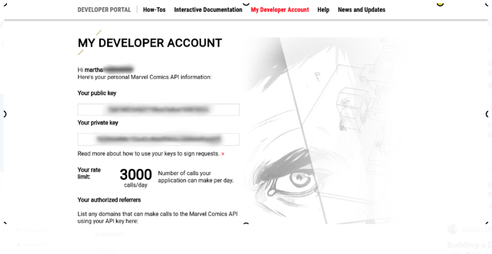
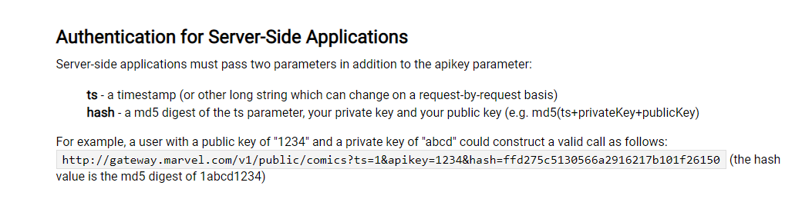

# API da Marvel

1. Cadastrar-se no link abaixo:

       https://developer.marvel.com/

3. Após cadastro salver public key e private key recebida.

3. Para se autenticar na API:

4. Site para criar o hash:

       https://blueimp.github.io/JavaScript-MD5/ 

6. Exemplos:

       http://localhost:8080/marvel/characters/id/1009368

       http://localhost:8080/marvel/characters/name/DOCTOR%20STRANGE